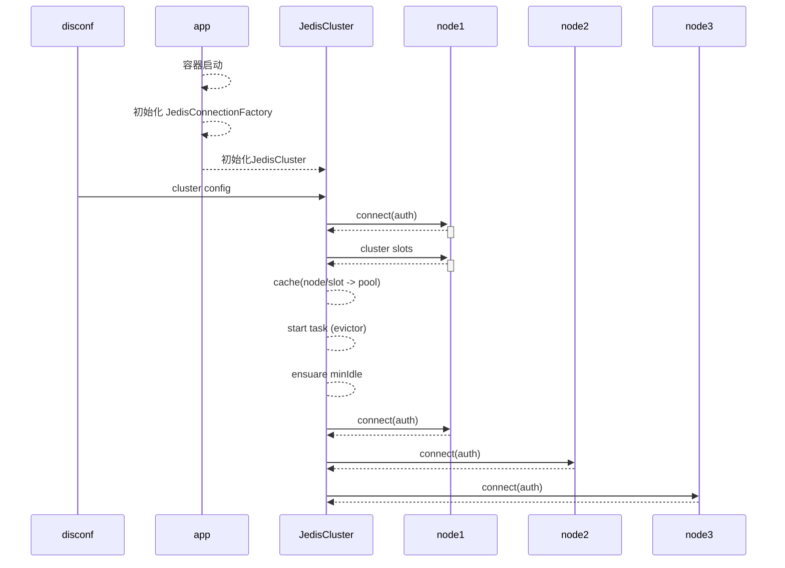

## JedisCluster 初始化

[toc]

### 1 流程



### 2 有限轮询

轮询所有节点，从第一个开始尝试连接并执行cluster slots获取集群槽信息，获取成功则停止轮询；否则尝试下一个节点：

```
private void initializeSlotsCache(Set<HostAndPort> startNodes, GenericObjectPoolConfig poolConfig, String password) {
	 	//轮询
    for (HostAndPort hostAndPort : startNodes) {
      Jedis jedis = new Jedis(hostAndPort.getHost(), hostAndPort.getPort());
      //连接
      if (password != null) {
        jedis.auth(password);
      }
      try {
      	//初始化缓存，成功则退出轮询
        cache.discoverClusterNodesAndSlots(jedis);
        break;
      } catch (JedisConnectionException e) {
        // try next nodes
      } finally {
      	//关闭当前连接
        if (jedis != null) {
          jedis.close();
        }
      }
    }
  }
```

### 3 分配缓存

Jedis在集群模式下，会为每个节点关联建立一个连接池并缓存：

* node -> pool：Map<String, JedisPool> nodes
* slot -> pool： Map<Integer, JedisPool> slots

这两个缓存将作为路由表，为后续命令的执行提供路由寻址。

构建缓存时，使用了读写锁r/w保证线程安全：

```
private final ReentrantReadWriteLock rwl = new ReentrantReadWriteLock();
private final Lock r = rwl.readLock();
private final Lock w = rwl.writeLock();
```

在redis-cli 客户端执行cluster slots命令，可以看到redis服务返回的是一个三维的slot数组：

```
1) 1) (integer) 0
   2) (integer) 5460
   3) 1) "10.204.58.14"
      2) (integer) 8080
      3) "70c395a272f4784463d8b16ee5188b38e71b8053"
   4) 1) "10.204.58.11"
      2) (integer) 8080
      3) "05363f37dd4bb5c132074118f695ded83e2bee86"
2) 1) (integer) 10923
   2) (integer) 16383
   3) 1) "10.204.58.12"
      2) (integer) 8080
      3) "e42e6eee91bf1411d7ae1bef57ad33ab1971aba8"
   4) 1) "10.204.58.15"
      2) (integer) 8080
      3) "a5c3abaea39688d13f786b97b2a449291bbaccfe"
3) 1) (integer) 5461
   2) (integer) 10922
   3) 1) "10.204.58.13"
      2) (integer) 8080
      3) "571148bb2d00ad5beafdfd6de43b5bb8ddebb33d"
   4) 1) "10.204.58.16"
      2) (integer) 8080
      3) "29da5e37ca7236b26b0bcb4a3ed41e6f4107ad56"
```

slot 平均分成3个分组，分组的slot范围分别为[0,5460], [5461, 10922], [10923, 16383],  每个分组都落在2个主从节点上，可以查看主从节点的 host:port

构建缓存本质上是将该三维数组逐层解析，转换为两个特定的字典:

```
public void discoverClusterNodesAndSlots(Jedis jedis) {
    w.lock();

    try {
    	//清空缓存
      reset();
      //获取clusterSlots信息，三维数组
      List<Object> slots = jedis.clusterSlots();

      for (Object slotInfoObj : slots) {
      	//slot分组
        List<Object> slotInfo = (List<Object>) slotInfoObj;

				//分组至少应该包含3个元素，前2个元素为分组范围，第三个元素为主节点信息
        if (slotInfo.size() <= MASTER_NODE_INDEX) { // MASTER_NODE_INDEX = 2
          continue;
        }

				//分组范围转换为slot编号数组
        List<Integer> slotNums = getAssignedSlotArray(slotInfo);

        // 解析分组落在的节点信息
        int size = slotInfo.size();
        for (int i = MASTER_NODE_INDEX; i < size; i++) {
          List<Object> hostInfos = (List<Object>) slotInfo.get(i);
          if (hostInfos.size() <= 0) {
            continue;
          }

          HostAndPort targetNode = generateHostAndPort(hostInfos);
          //建立节点到pool的缓存，如果pool没建立则创建Pool
          setupNodeIfNotExist(targetNode);
          if (i == MASTER_NODE_INDEX) { //仅为主节点创建slot到pool的缓存
            assignSlotsToNode(slotNums, targetNode);
          }
        }
      }
    } finally {
      w.unlock();
    }
  }
```


### 4 创建连接池

JedisPool持有一个internalPool，它是一个commons-pool2的GenericObjectPool，说明jedis连接池依赖第三方工具commons-pool实现连接池管理

```
public void initPool(final GenericObjectPoolConfig poolConfig, PooledObjectFactory<T> factory) {

  if (this.internalPool != null) {
    try {
      closeInternalPool();
    } catch (Exception e) {
    }
  }

	//一个对象池需要持有factory和poolConfig，factory负责创建对象，cofig定义了连接池规则
  this.internalPool = new GenericObjectPool<T>(factory, poolConfig);
}
```

### 5 空闲检测

连接池初始化完毕后启动**空闲连接检测**任务，该任务检测到PoolConfig包含minIdle时，将创建保底数量的连接。

```
//启动evictor任务
final void startEvictor(long delay) {
  	synchronized (evictionLock) {
  		if (null != evictor) {
  			EvictionTimer.cancel(evictor);
  			evictor = null;
  			evictionIterator = null;
  	}
  		if (delay > 0) {
  			evictor = new Evictor();
  			EvictionTimer.schedule(evictor, delay, delay);
  		}
  	}
}
```

**定时连接检测：**

* 驱逐过期的连接
* 保证min-idle数量的连接

```
public void run() {
    ClassLoader savedClassLoader =
            Thread.currentThread().getContextClassLoader();
    try {
        // Set the class loader for the factory
        Thread.currentThread().setContextClassLoader(
                factoryClassLoader);

        // Evict from the pool
        try {
            evict();
        } catch(Exception e) {
            swallowException(e);
        } catch(OutOfMemoryError oome) {
            // Log problem but give evictor thread a chance to continue
            // in case error is recoverable
            oome.printStackTrace(System.err);
        }
        // Re-create idle instances.
        try {
            ensureMinIdle();
        } catch (Exception e) {
            swallowException(e);
        }
    } finally {
        // Restore the previous CCL
        Thread.currentThread().setContextClassLoader(savedClassLoader);
    }
}
```